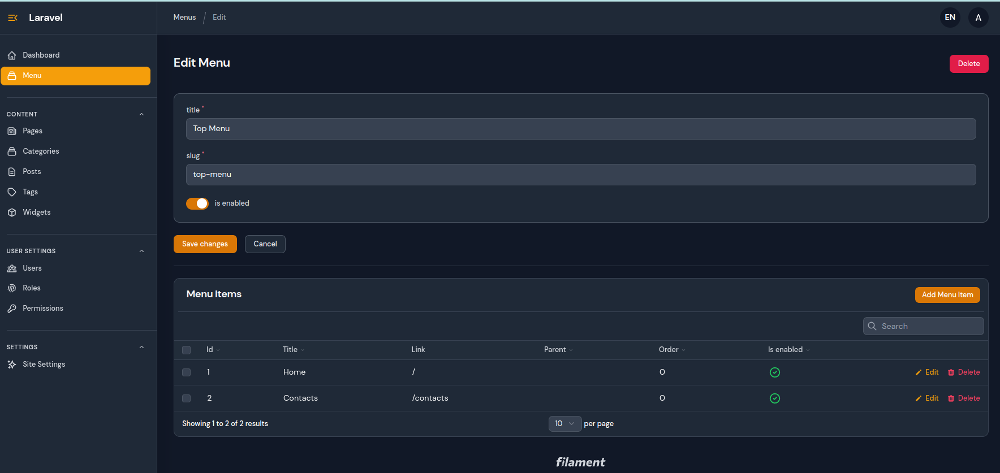
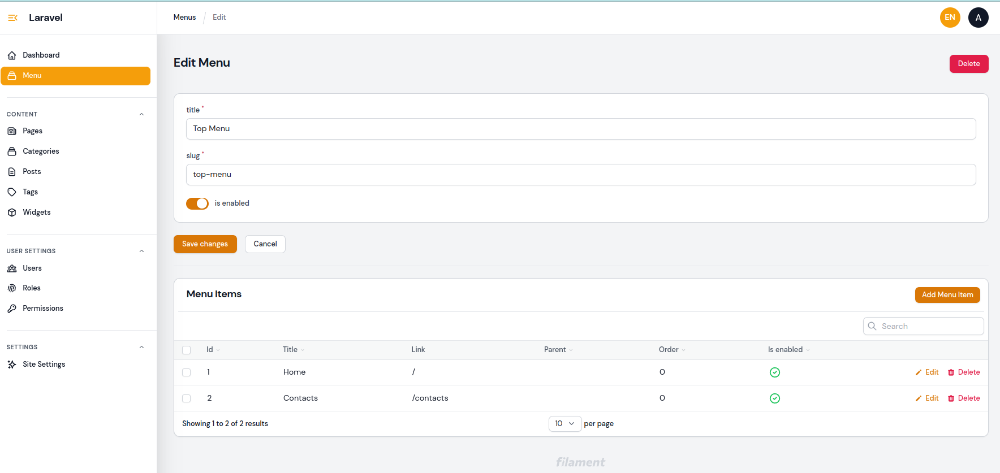

    
    
    

## About Adm CMS

It is a Filament based web application (cms) for Laravel developers. After install you will have:
### Dashboard
- Posts
- Pages (with custom fields)
- Categories
- Tags
- Menu
- Site settings
- Widgets
- Users
- Roles
- Permissions

### For developer
- helpers files with functions in app/Adm/Helpers
- template system in blade
- translations
- own template settings
- own template functions
- routes for taxonomy and content in routes/adm.php
- services in app/Adm/Services

Almost all files of Adm cms stored in app/Adm

## How install
- Clone the project
- composer install
- npm i
- npm run build
- run server and db on your environment 
- php artisan adm:start
- go to your-website/admin

login: admin@admin.com
password: password
